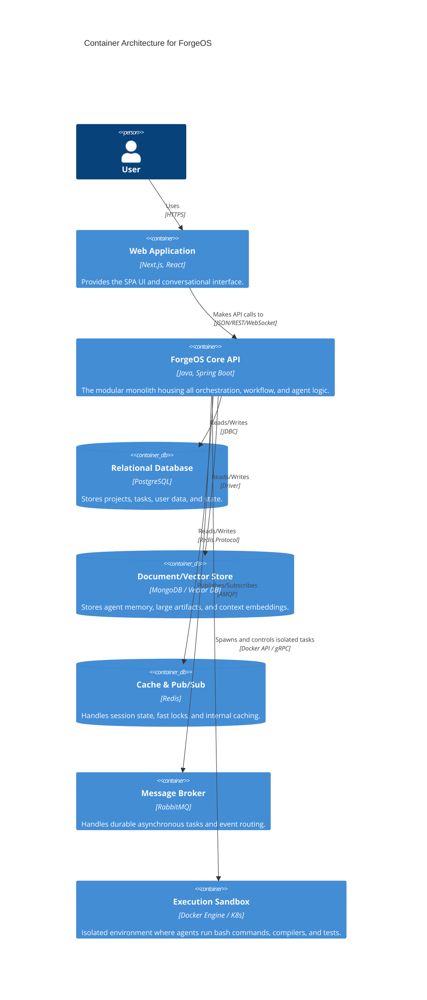

# Container Architecture

This document defines the high-level deployable units (containers) of the ForgeOS system.

## Container Diagram

## Primary Containers

1. **Web Application**: Static output served by Next.js or a CDN, running React on the client side for highly interactive visualizations.
2. **ForgeOS Core API**: The Spring Boot modular monolith. It scales horizontally behind a load balancer.
3. **Execution Sandbox**: A crucial separation. We do not run `npm install` or `mvn test` inside the Core API container. The Core API manages ephemeral Sandbox containers to execute untrusted agent commands securely.
4. **Data Tier**: 
    - **PostgreSQL**: Strict relational data (Users, Projects, Tasks, Billing).
    - **MongoDB/VectorDB**: Unstructured data, large text blobs, and RAG embeddings for the Context Engine.
