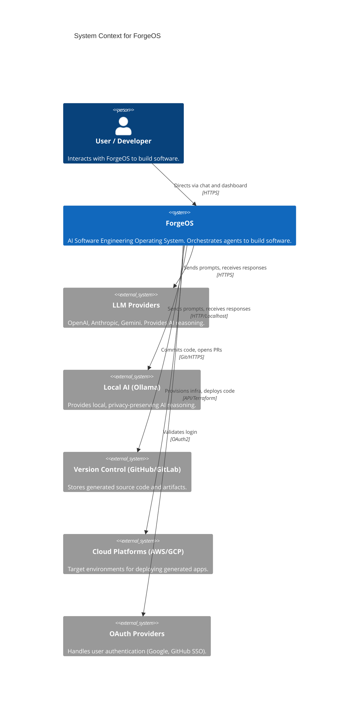

# System Context

This document describes how ForgeOS fits into the broader technology ecosystem and interacts with external entities.

## Context Diagram

## Key External Interfaces

- **LLM Providers**: The primary "brain" dependency. ForgeOS manages these via a failover router.
- **Version Control Systems**: ForgeOS acts as a virtual developer, interacting with standard Git repositories to manage state and artifacts.
- **Deployment Environments**: ForgeOS DevOps agents will interact with cloud APIs or Kubernetes clusters to deploy the user's generated applications.
- **Identity Providers**: standard OAuth2 delegation to avoid building custom identity management.
