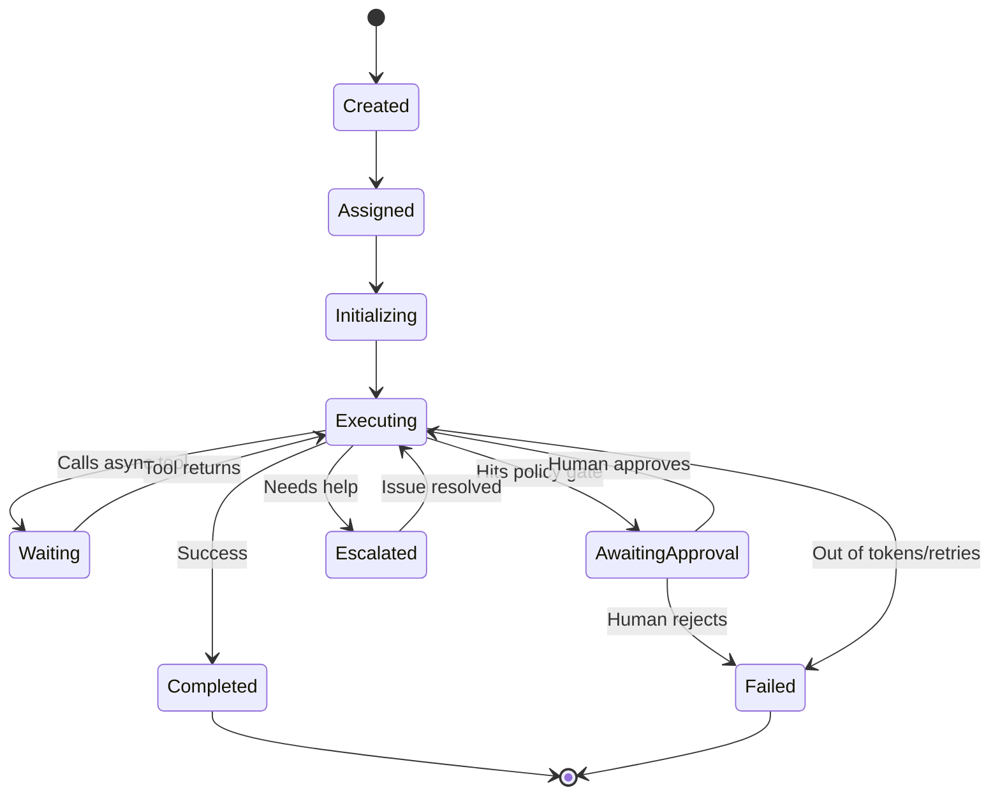

# Agent State Model

The state of an agent is tracked durably in the Orchestrator's relational database.

## State Machine

## Durable Transitions
State transitions must be committed to the database *before* taking action, allowing the system to recover gracefully if the ForgeOS server crashes during `Executing`.
