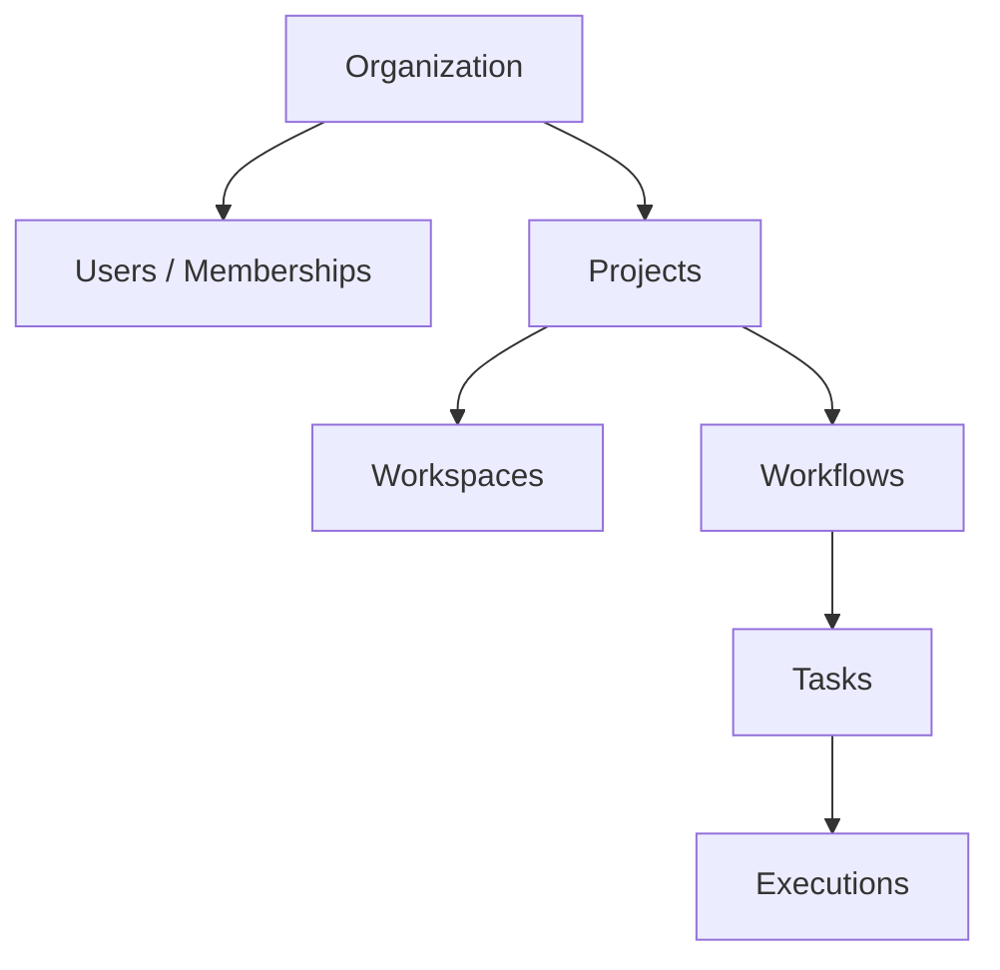

# Tenant Isolation

ForgeOS is inherently multi-tenant. The root of tenancy is the **Organization**.

## Hierarchical Tenancy

## Enforcement Strategy
1. **Foreign Key Anchors**: Projects link to Organizations. Workflows link to Projects. Every query to a leaf node (like `Tasks`) must ultimately be scoped by the current request's Tenant ID (the `organization_id`).
2. **Never `findAll()`**: Repositories must not expose parameterless `findAll()` methods that fetch global state. All retrieval methods must be scoped by the parent entity ID (e.g., `findByOrganizationId()`, `findByProjectId()`).
3. **Audit Tracking**: The `audit_events` table includes an explicit `tenant_id` column to allow for isolated, tenant-specific security reporting.
