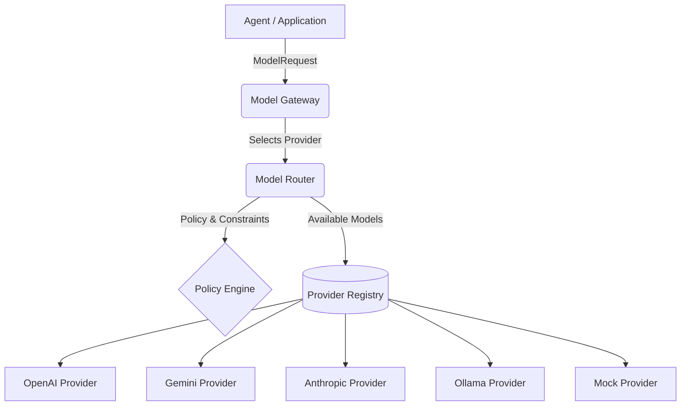

# AI Model Gateway Architecture (Phase 12)

The AI Model Gateway is the single internal abstraction through which ForgeOS requests AI capabilities. It isolates business modules (Agent Runtime, Workflow Engine) from specific providers like OpenAI, Anthropic, or Ollama.

## Architecture Diagram

## Directory Structure
- `provider-abstraction.md`: Interface boundaries.
- `model-router.md`: Policy selection logic.
- `openai.md` / `ollama.md`: Supported providers.
- `privacy-routing.md`: Security and data classification.
