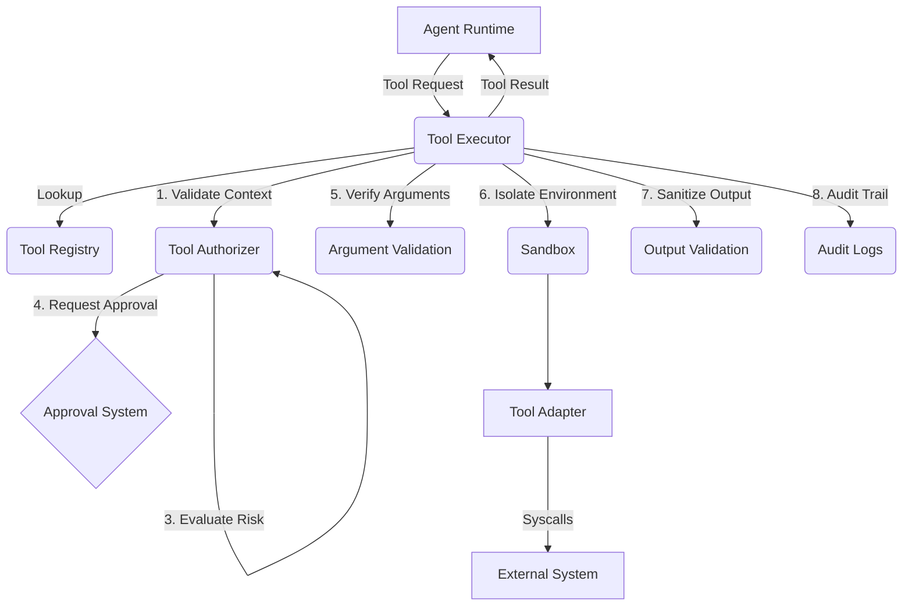

# ForgeOS Tool Execution System (Phase 13)

The Tool System is the critical security boundary that protects the ForgeOS host environment from malicious or hallucinated AI instructions. AI agents *never* have direct, unrestricted access to the host machine.

## Architecture

## Core Principles
1. **Never trust AI arguments**: Path traversals (`../`) and command injections must be stripped or blocked structurally.
2. **Deny by default**: Tools require explicit RBAC permissions based on the tenant context.
3. **Risk-based execution**: `CRITICAL` tools (like production deployment) are blocked outright until Phase 19 (Sandbox Execution) is fully implemented.
