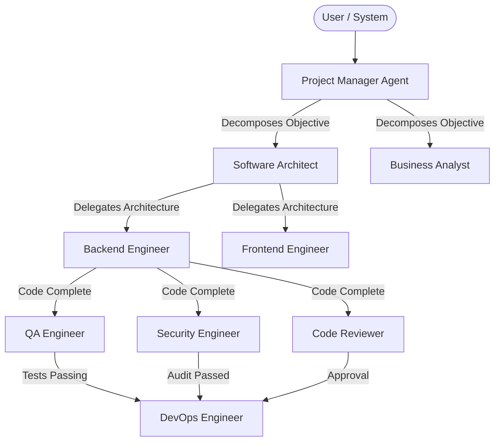

# Agent Runtime Framework (Phase 14)

The ForgeOS Agent Runtime controls the lifecycle, execution, constraints, and reasoning loop of specialized AI workers. It sits between the Model Gateway (the brains) and the Tool System (the hands).

## Agent Organization Diagram

All agents operate strictly through governed systems:
- **Model Gateway**: For reasoned decisions.
- **Tool System**: For physical changes.
- **Approval System**: For high-risk deployments.
