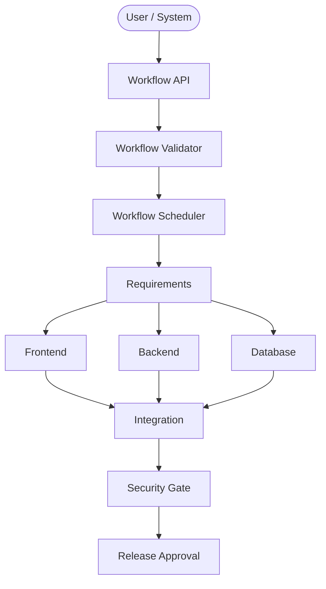

# Workflow Orchestrator (Phase 15)

The Workflow Orchestrator coordinates multiple specialized AI agents, human tasks, and gates into a cohesive Directed Acyclic Graph (DAG) for software development.

## Architecture

## Guiding Principles

1. **No Infinite Loops**: The DAG strictly prevents infinite agent remediation cycles.
2. **Idempotency**: External tasks (Cloud, Git, Deploy) must be idempotent to support retry policies.
3. **Delegation**: The orchestrator assigns tasks to the `AgentRuntime` (Phase 14). It does NOT directly execute models.
