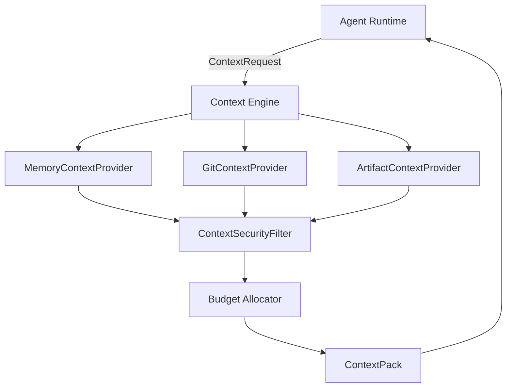

# Context Engine (Phase 17)

The ForgeOS Context Engine sits between the Agent Runtime and the AI Model Gateway. It is responsible for compiling a secure, budgeted, highly relevant "Context Pack" for agents to use. 

## Architecture

## Why Not Just Dump Everything?
1. **Security**: An agent should not see Tenant B's files while working on Tenant A's project.
2. **Context Limits**: Modern LLMs have large context windows, but dumping an entire repository ruins recall (Lost in the Middle syndrome) and costs an astronomical amount of money in tokens.
3. **Prompt Injection**: Unverified markdown documents could contain malicious instructions. The Context Engine ensures all retrieved text is explicitly labeled as `DATA` with its origin `Authority`, preventing malicious READMEs from overriding system policies.
