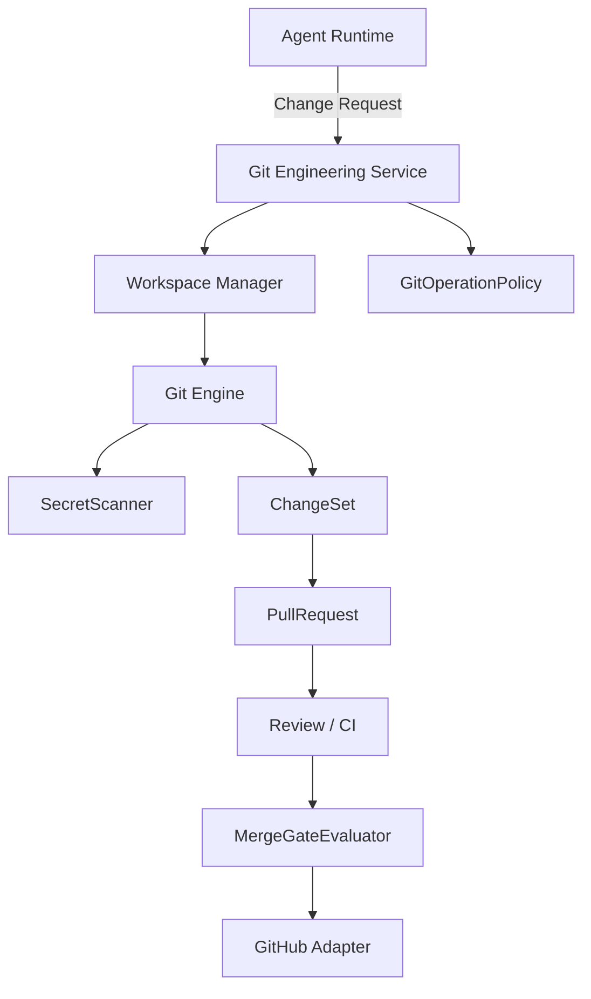

# Git & GitHub Engineering System (Phase 18)

The ForgeOS Git & GitHub Engineering System acts as a strict architectural layer separating the Agent Runtime from the actual source code repositories. Agents never receive unfiltered access to `git` on the host machine or raw GitHub Personal Access Tokens (PATs). 

## Architecture

## Security Posture
1. **Workspace Isolation**: `WorkspaceManager` restricts all file operations to a deterministic `/tmp/forgeos/workspaces/{tenantId}/{repositoryId}/{workspaceId}`. Any path traversal attempt (e.g. `../../etc/passwd`) immediately throws a `SecurityException`.
2. **Merge Gates**: The `MergeGateEvaluator` acts as the definitive chokepoint before code can hit `master`. If a PR targets a protected branch, it enforces CI checks, Security Scans, and *Human Approval*.
3. **Secret Scanning**: The `SecretScanner` interface acts before any commit is processed, dropping modifications that contain credentials.
