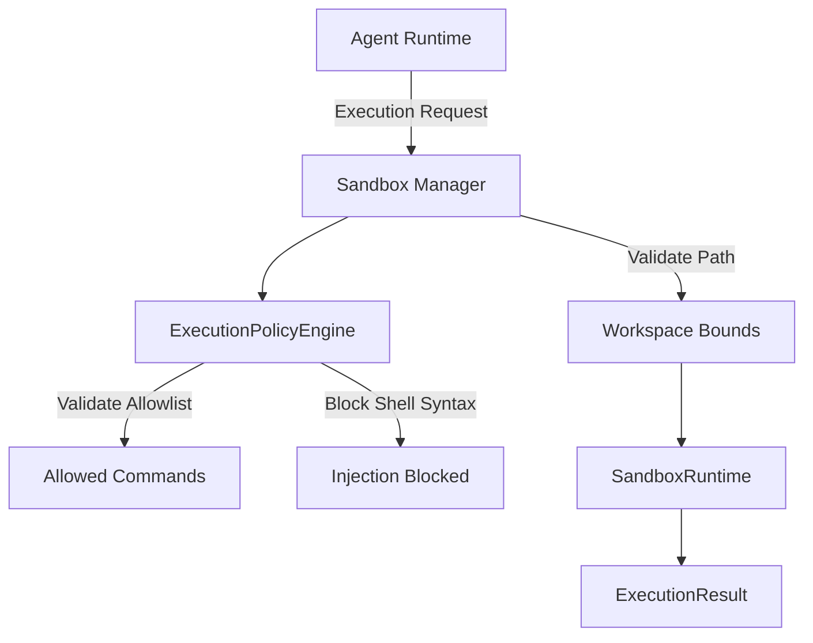

# Secure Execution Sandbox (Phase 19)

The ForgeOS Secure Execution Sandbox ensures that AI agents can execute necessary commands (like builds and tests) without compromising the host machine or exposing sensitive data. It achieves this by routing all executions through a strict policy engine.

## Architecture

## Security Posture
1. **Command Allowlisting**: Only specific, safe executables are permitted (e.g., `mvn`, `npm`). Execution of arbitrary shells or dangerous tools (`rm`) is strictly blocked.
2. **Command Injection Prevention**: Arguments are deeply inspected to ensure no shell chaining (`&&`, `|`, `;`) or execution substitutions occur, stopping injection at the policy layer.
3. **Workspace Path Isolation**: The `SandboxManager` ensures that the `workingDirectory` of any command request strictly resolves to a path within the assigned sandbox. Traversal (`../../`) throws a `SecurityException`.
4. **Runtime Abstraction**: Execution is abstracted via `SandboxRuntime`. In production, this can securely map to a `DockerSandboxRuntime` dropping privileges, restricting networks, and mapping read-only filesystems.
