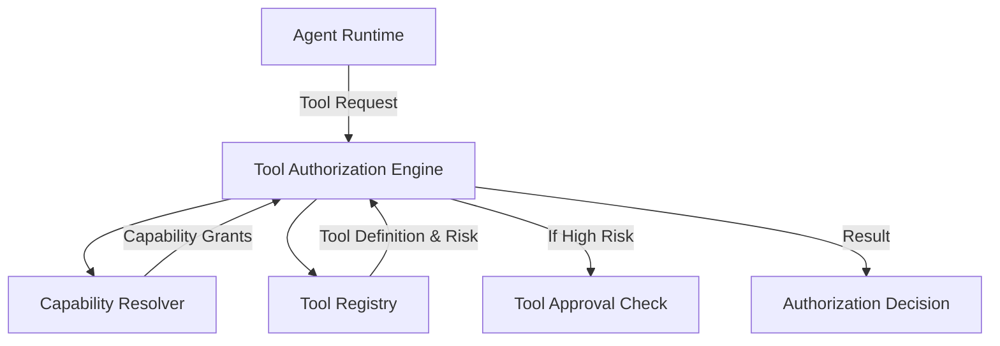

# Agent Tool & Capability System (Phase 20)

The ForgeOS Agent Tool & Capability System enforces the principle of least privilege. Rather than giving an agent a generic API key and crossing our fingers, this system explicitly models what an agent is allowed to do, and strictly enforces those rules before any tool executes.

## Architecture

## Security Posture
1. **Deny by Default**: If an agent lacks a required capability grant for a requested tool, the `ToolAuthorizationEngine` returns `DENY`.
2. **Risk-Based Approvals**: Tools are categorized by risk (`LOW`, `MEDIUM`, `HIGH`, `CRITICAL`). If an agent requests a `HIGH` or `CRITICAL` tool (like `github.merge` or `production.deploy`), the engine returns `REQUIRES_APPROVAL` and blocks execution until human approval is injected.
3. **Capability Grants**: Agents do not own tools; they own capabilities (e.g. `git.read`). Multiple tools might require the same capability. This decouples the agent's identity from the specific implementation of the tool.
