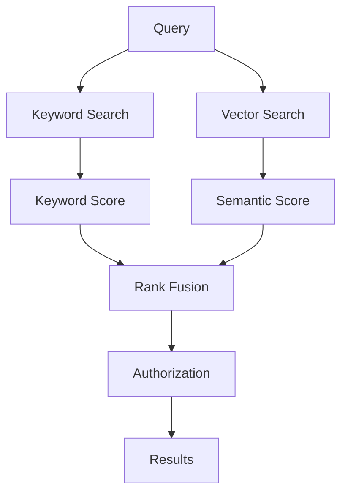

# HYBRID SEARCH

## Search Ranking Architecture

```mermaid
graph TD
    A[Query] --> B
    A --> C
    
    B[Keyword Search] --> D[Keyword Score]
    C[Vector Search] --> E[Semantic Score]
    
    D --> F
    E --> F
    
    F[Rank Fusion] --> G[Authorization]
    G --> H[Results]
```
