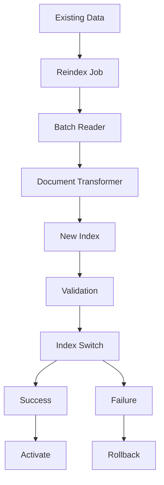

# INDEX REINDEXING

## Reindex Architecture

```mermaid
graph TD
    A[Existing Data] --> B[Reindex Job]
    B --> C[Batch Reader]
    C --> D[Document Transformer]
    D --> E[New Index]
    E --> F[Validation]
    F --> G[Index Switch]
    
    G --> H[Success]
    G --> I[Failure]
    
    H --> J[Activate]
    I --> K[Rollback]
```
