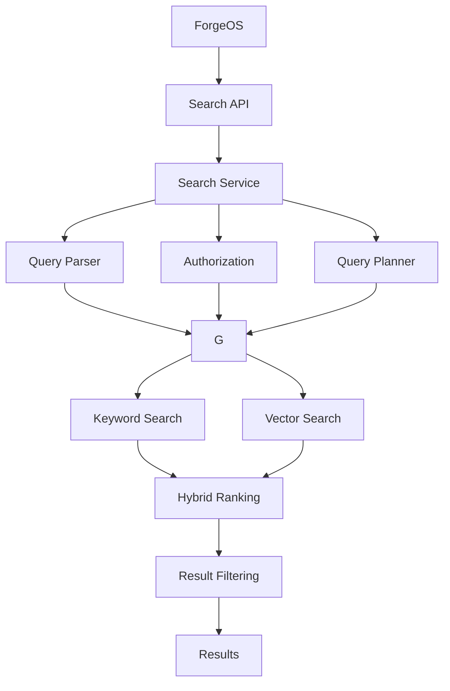

# SEARCH ARCHITECTURE

## System Architecture

```mermaid
graph TD
    A[ForgeOS] --> B[Search API]
    B --> C[Search Service]
    
    C --> D[Query Parser]
    C --> E[Authorization]
    C --> F[Query Planner]
    
    D --> G
    E --> G
    F --> G
    
    G --> H[Keyword Search]
    G --> I[Vector Search]
    
    H --> J[Hybrid Ranking]
    I --> J
    
    J --> K[Result Filtering]
    K --> L[Results]
```
