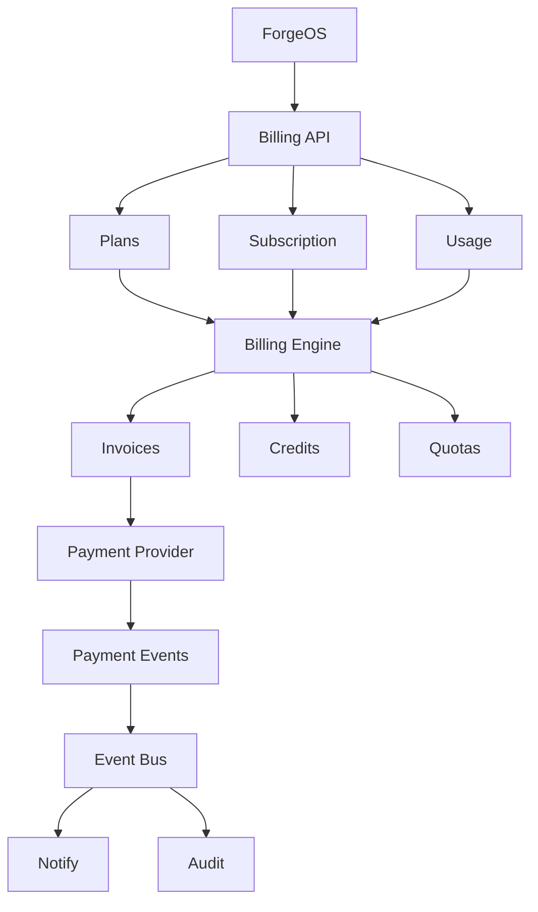

# BILLING ARCHITECTURE

## System Architecture

```mermaid
graph TD
    A[ForgeOS] --> B[Billing API]
    B --> C[Plans]
    B --> D[Subscription]
    B --> E[Usage]
    
    C --> F[Billing Engine]
    D --> F
    E --> F
    
    F --> G[Invoices]
    F --> H[Credits]
    F --> I[Quotas]
    
    G --> J[Payment Provider]
    J --> K[Payment Events]
    K --> L[Event Bus]
    
    L --> M[Notify]
    L --> N[Audit]
```
